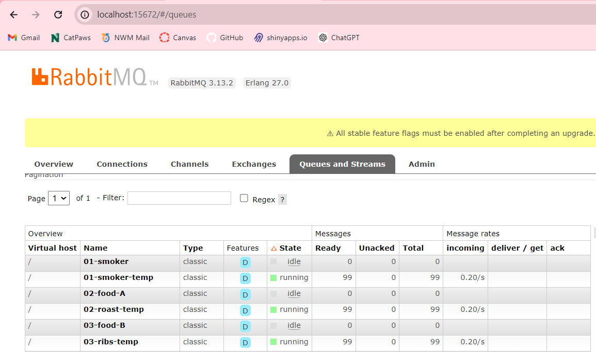

## Bambee Garfield
## CSIS 44671 - Module 5

# streaming-05-smart-smoker

>Using RabbitMQ we will stream info from a smart smoker. Read one value every half minute. (sleep_secs = 30)

smoker-temps.csv has 4 columns:

[0] Time = Date-time stamp for the sensor reading
[1] Channel1 = Smoker Temp --> send to message queue "01-smoker"
[2] Channel2 = Food A Temp --> send to message queue "02-food-A"
[3] Channel3 = Food B Temp --> send to message queue "03-food-B"

## Before You Begin 

1. In GitHub, create a new repo for your project - name it streaming-05-smart-smoker
2. Add a README.md during the creation process. (If not, you can always add it later.)
3. Clone your repo down to your machine. 
4. In VS Code, add a .gitignore (use one from an earlier module), start working on the README.md. Create it if you didn't earlier.
5. Add the csv data file to your repo. 
6. Create a file for your bbq producer.

## Create a Python Virtual Environment

We will create a local Python virtual environment to isolate our project's third-party dependencies from other projects.

1. Open a terminal window in VS Code.
2. Use the built-in Python utility venv to create a new virtual environment named `.venv` in the current directory.

python -m venv .venv

In the same VS Code terminal window, activate the virtual environment.

- On Windows, run: `.venv\Scripts\activate`

## Create and implement the Producer 

1. Implement your bbq producer. More detailed help provided in links below. 
2. Use the logic, approach, and structure from Module 4, version 2 and version 3.
3. These provide a current and solid foundation for streaming analytics - modifying them to serve your purpose IS part of the assignment.
4. Do not start from scratch - do not search for code - do not use a notebook.
5. Use comments in the code and repo to explain your work. 
6. Use docstring comments and add your name and date to your README and your code files. 
7. Explain your project in the README. Include prerequisites and how to run your code. 
8. Document your project works - display screenshots of your console and maybe the RabbitMQ console. 
9. If you only have a producer, you won't have a consumer showing messages yet, so you'll need to be creative. We'll build the consumers next.

## Reference ✔️

- [RabbitMQ Tutorial - Work Queues](https://www.rabbitmq.com/tutorials/tutorial-two-python.html)

## Screenshot ✔️

Show a example of your producer here:

