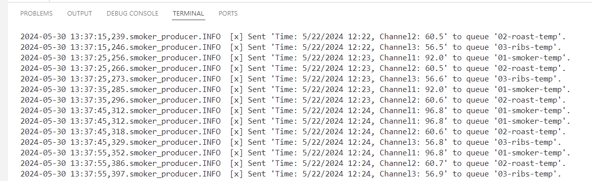

## Bambee Garfield
## CSIS 44671 - Module 4

# streaming-04-multiple-consumers

> Use RabbitMQ to distribute tasks to multiple workers

One process will create task messages. Multiple worker processes will share the work. 

## Before You Begin ✔️

1. Fork [this starter repo](https://github.com/denisecase/streaming-04-multiple-consumers) into your GitHub.
1. Clone your repo down to your machine.
1. View / Command Palette - then Python: Select Interpreter
1. Select your conda environment. 

## Read ✔️

1. Read the [RabbitMQ Tutorial - Work Queues](https://www.rabbitmq.com/tutorials/tutorial-two-python.html)
1. Read the code and comments in this repo.

## RabbitMQ Admin ✔️

RabbitMQ comes with an admin panel. When you run the task emitter, reply y to open it. 

(Python makes it easy to open a web page - see the code to learn how.)

## Create a Python Virtual Environment ✔️

We will create a local Python virtual environment to isolate our project's third-party dependencies from other projects.

1. Open a terminal window in VS Code.
2. Use the built-in Python utility venv to create a new virtual environment named `.venv` in the current directory.

python -m venv .venv

In the same VS Code terminal window, activate the virtual environment.

- On Windows, run: `.venv\Scripts\activate`

## Execute the Producer ✔️

1. In the VS Code terminal, run v3_emitter_of_tasks.py (say y to monitor RabbitMQ queues)

## Execute a Consumer / Worker ✔️

1. Oopen two separate terminals or command prompts. In two separate terminals, run 

python v3_listening_worker.py

You should see the two terminals alternating tasks based on the resources being used (.... takes longer than ...)

## Reference ✔️

- [RabbitMQ Tutorial - Work Queues](https://www.rabbitmq.com/tutorials/tutorial-two-python.html)

## Screenshot ✔️

See a running example with at least 3 concurrent process windows here:
